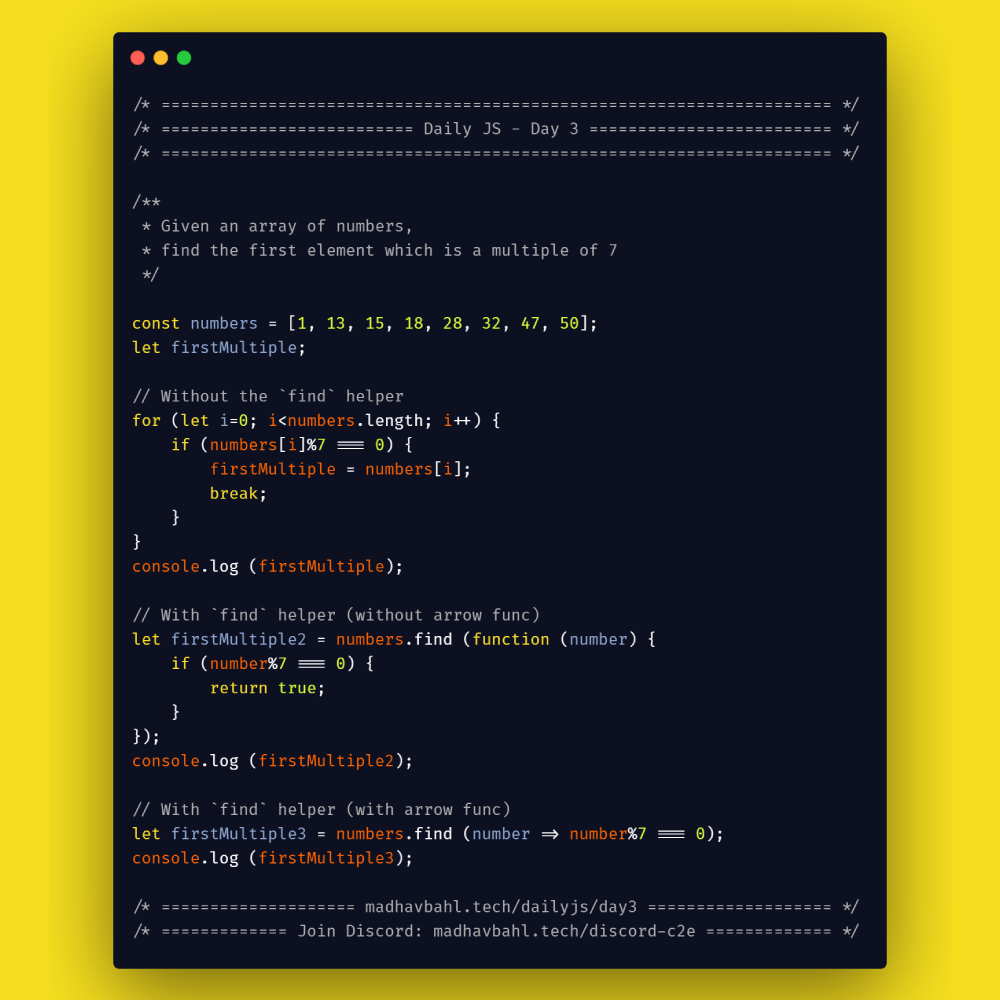

# Day 3: The `find` helper


The `find` helper loops through an array to look for a particular element (first occurance), which passes the given criteria. 

It runs the provided function over each element, and if the particular element passes the criteria, it is returned. If no element found, `undefined` is returned.

This helper method does not change the original array.

## The Drawback

The `find` helper will not work when you want to find more than one occurances, it will work only when you need the first occurance.

## Which element to choose?

In the find helper we pass an iterator function which iterates over all the elements of the array. The function should have a condition, and the first element which satisfies that condition is returned.

When the condition is passed, the iterator function  must return `true`. The element at which the iterator function returns a `true` is taken to be the required element.

## [Example 1](./1.js)

**Given an array of numbers, find the first element which is a multiple of 7**

```js
/**
 * Given an array of numbers,
 * find the first element which is a multiple of 7
 */

const numbers = [1, 13, 15, 18, 28, 32, 47, 50];
let firstMultiple;

// Without the `find` helper
for (let i=0; i<numbers.length; i++) {
    if (numbers[i]%7 === 0) {
        firstMultiple = numbers[i];
        break;
    }
}
console.log (firstMultiple);

// With `find` helper (without arrow func)
let firstMultiple2 = numbers.find (function (number) {
    if (number%7 === 0) {
        return true;
    }
});
console.log (firstMultiple2);

// With `find` helper (with arrow func)
let firstMultiple3 = numbers.find (number => number%7 === 0);
console.log (firstMultiple3);
```

## [Example 2](./2.js)

**Given an array of objects having the data of students, find the student having register number 9018**

```js
const students = [
    { regNo: 0192, name: "Madhav" },
    { regNo: 1302, name: "Ram" },
    { regNo: 6723, name: "Rahul" },
    { regNo: 9018, name: "John" },
    { regNo: 4211, name: "Taylor" },
];

let wantedStudent = students.find (student => student.regNo === 9018);

console.log (wantedStudent);
```

## Syntax

```js
array.find(function(currentValue, index, arr),thisValue)
```

- **currentValue**: Required.
    The value of the current element
- **index**: Optional.
    The array index of the current element
- **arr**: Optional.
    The array object the current element belongs to
- **thisValue**: Optional.
    A value to be passed to the function to be used as its "this" value

## Practice Questions

To be added..

## Download your free eBook

<a href="./ebook.pdf" style="display: inline-block; margin: 0.3em; padding: 1.2em 5em; overflow: hidden; position: relative; text-decoration: none; text-transform: uppercase; border-radius: 3px;  -webkit-transition: 0.3s; -moz-transition: 0.3s; -ms-transition: 0.3s; -o-transition: 0.3s;  transition: 0.3s; box-shadow: 0 2px 10px rgba(0,0,0,0.5); border: none;  font-size: 15px; text-align: center;   background-color: #03A9F4; color: white; margin-left: 38%;" download class="btn-rounded-white">Claim Your Free PDF Here</a>

## Carbon code sample

